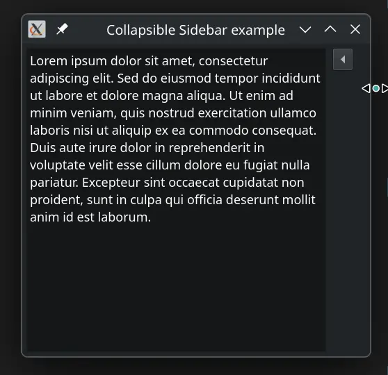

This is a fork from [MichaelVoelkel/qt-collapsible-section](https://github.com/MichaelVoelkel/qt-collapsible-section/tree/master), where instead of a horizontal section there is a sliding sidebar.

Special thanks to "x squared" who has posted the original code for this idea at StackOverflow: http://stackoverflow.com/a/37119983/2573127

# QT Collapsible Sidebar

This is a simple collapsable sidebar for Qt in C++. It has been tested with `Qt 5.15`.

## Sample Code
```
    ui::CollapsibleSidebar* sidebar = new ui::CollapsibleSidebar("Sidebar", 150);
    
    auto* anyLayout = new QVBoxLayout();
    anyLayout->addWidget(new QLabel("Some Text in Sidebar", sidebar));
    anyLayout->addWidget(new QPushButton("Button in Sidebar", sidebar));
    
    sidebar->setContentLayout(*anyLayout);
```

## Sample Animation


